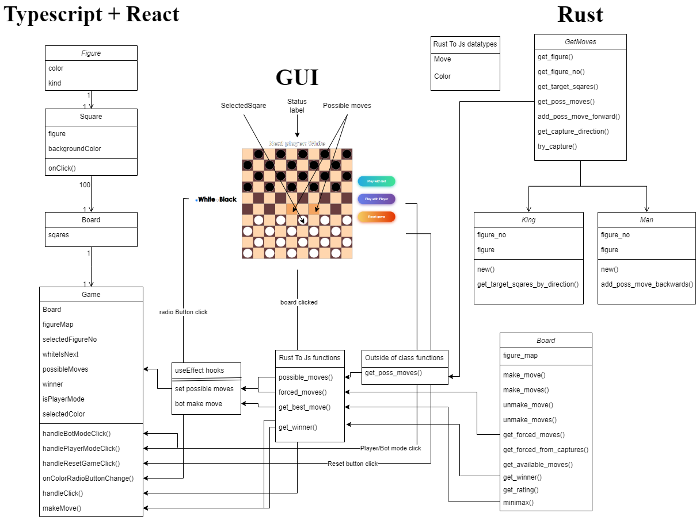

# Advanced Programming in C++

A Browser Game Using WebAssembly

#### Preliminary Project Documentation

**Team Members**: Katarzyna Glaza, Jakub Nitkiewicz

## Table of Contents
1. [General Project Description](#_Toc138335219)
2. [Project Theme](#_Toc373063069)
3. [Game Rules](#_Toc1065200622)
4. [Additional Assumptions](#_Toc750165419)
5. [Technologies](#_Toc793952479)
6. [Tasks to Be Completed](#_Toc2088189025)
7. [Stage 1](#_Toc2045757164)
8. [Stage 2](#_Toc535475920)
9. [Planned Tests](#_Toc1717203983)

---

### General Project Description

The task is to create a client-server game where the client operates exclusively in a web browser. The client should be implemented using WebAssembly.

The game must support at least two players. Game rules can be sourced from Wikipedia or other references. The team has the following options:
1. Two-player game where the application enforces rules.
2. Single-player game against the computer, which requires providing an algorithm for the AI player, such as a game tree.

For the first option, game logic does not need to be server-side.

WebAssembly (WASM) can be generated from languages like Rust or C++.

### Project Theme

The two-player game to be implemented is Polish Draughts (checkers), developed in two modes: two-player and player versus computer. Additionally, an algorithm for computer move selection will be implemented using the minimax algorithm with alpha-beta pruning.

### Game Rules

The game rules are as follows:
- Players' pieces are placed on dark squares of a 10x10 board. Each player starts with 20 pieces of their color (white or black).
- Pieces are arranged so that the two central rows of the board are empty.
- The player with white pieces moves first; moves alternate between players.
- Capturing opponent pieces is mandatory and must continue to completion if possible. If a player has multiple capture options, they must make the maximum number of captures.
- The goal is to capture all opponent pieces or prevent the opponent from making a move.
- Pieces move diagonally to adjacent empty squares.
- For capturing, a piece can jump over an opponent's piece to an empty square beyond it, and multiple jumps are allowed.
- A piece reaching the opposite end of the board becomes a king, which can move any number of squares diagonally and can make continuous captures.

### Additional Assumptions

The following assumptions and features will be included:
- The user can choose between two modes: a game with another user or a game against the computer.
- In two-player mode, users will enter their names and wait for the second player to join.
- Before starting, players can choose their piece color. Pieces will be positioned at the bottom of the board for each user, and captured pieces will be removed.
- On-screen counters will track the number of captured pieces for both players.

### Technologies

The game will be implemented in Rust. The backend will use WebAssembly, and the frontend will use JavaScript. Additional tools include:
- `wasm-pack` for building, testing, and publishing WebAssembly generated by Rust.
- `cargo`, Rust’s package manager.
- `npm`, JavaScript’s package manager.
- `rustfmt` for code formatting.
- `clippy` for static code analysis.

### Tasks to Be Completed

The project is divided into two primary stages:

#### Stage 1
1. Configure Rust tools for WebAssembly compilation and integrate with JavaScript.
2. Create a GUI.
3. Ensure data flow between all components.

#### Stage 2
1. Implement two-player game logic.
2. Implement the minimax algorithm with alpha-beta pruning for the single-player mode.

### Planned Tests

Unit tests will be conducted for game logic methods, along with integration tests to verify component interactions. Tools like `cargo-test` and `wasm-pack` will be used. For the minimax algorithm, depth parameters will be adjusted to ensure the computer does not play "too well," giving users a fair chance to win.

### Application Framework

#### Build and Test Instructions:

**Prerequisites:**

Tools:
- `rustup`
- `rustc`
- `rustdoc`
- `typedoc`
- `cargo`
- `cargo-generate`
- `npm`

Instructions for downloading are available [here](https://rustwasm.github.io/book/game-of-life/setup.html).

**Steps:**
- Clone the project.
- In the `rust-wasm-lib` folder, run `wasm-pack build`.
- In the project’s root directory, run `npm install`.
- To test the solution, run `npm start`.

#### Documentation Generation:

For Rust:
`rustdoc rust-wasm-lib/src/lib.rs --crate-name docs`

For TypeScript:
`npx typedoc src/index.tsx`

### Final Documentation

#### System Architecture Diagram

#### Achievements:
- **Stage 1 Goals:** Configuration of tools, creation of a basic GUI, and establishing data flow between Rust and TypeScript.
- **Stage 2 Goals:** Implementation of game logic for both two-player and single-player modes.

#### Unachieved Goals:
- In two-player mode, we planned for each player to see their pieces at the bottom of the board in separate browser windows. This was not implemented, and the game runs in a single window, with one player's pieces at the top and the other's at the bottom.
- Piece capture counters were deemed unnecessary and not implemented.

#### Challenges and Solutions:
- Initial difficulty with using TypeScript variables in Rust. This was solved using the `serde_wasm_bindgen` library.
- Rust functions initially didn’t work in TypeScript without proper library initialization. This was resolved with dynamic imports and initialization in `useEffect`.

#### Changes from Original Plan:
- Initially planned to use JavaScript + React + Rust but switched to TypeScript + React + Rust for better type safety and compatibility.

#### Why the Project Deserves a Good Grade:
- All primary goals were achieved.
- The interface is clean, and the code follows best practices.
- The code effectively leverages advanced features of each language used.
- Formatting tools were utilized for consistent code style.

